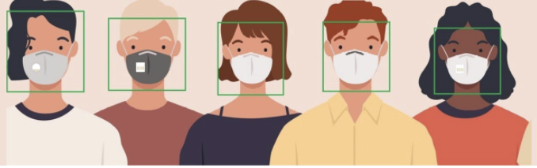

# Mask Classification Project

The project involves our team of four members to develop a convolutional neural network for the classification of the people wearning mask and it's relevant information such as if it is a procedural or cloth mask. 


## Process involved in the Model Training
1. Data Gathering. 
2. Evaulation and cleaning the existing datasets and applying the preprocessing to obtain the optimal results.
3. Convolutional Neural Network Model Training.
4. Analyse the performance of the model with the confusion matrix. 

## Required DataSets
The datasets required to run the model training can be downloaded from the Google Drive link 
https://drive.google.com/drive/folders/1BXyuxUizX9zzhwwTt5Bw-yedemi8drb2?usp=sharing


## Libraries. 
<ul>
    <li> Pytorch </li>
    <li> Matplotlib </li>
    <li> Sklearn </li>
    <li> Numpy</li>
    <li> Skorch </li>
</ul>

All the above packages can be installed directly using Anaconda Installer which will also install Jupyter notebooks present in the ```instructions.txt``` file. Anaconda downloader can be downloaded from [Download Link](https://www.anaconda.com/distribution/)

<hr/>

## Team Members
<ol>
    <li> Vinayak Sareen.</li>
    <li> Junaid Ijaz.</li>
    <li> Satinder.</li>
</ol>

<hr />

# Instructions.


## Step 1: Download Python.

Install the python 3.6, Now there are various methods but the easy one is to install 
Anaconda for which installation guide can be found at: [https://docs.anaconda.com/anaconda/install/index.html]


## Download the Required Libraries. 
Based on the installation, if the anaconda was method of installation for the python installation, then it comes with packaged with some data science libraries. Otherwise, each dependency needs to be installed using pip or pip3 package manager. 

<ul>
  <li> Numpy. - Provides the efficient method to store the data ~ similar to tensors.</li>
  <li> Matplotlib - Visualisation of the dataset </li>
  <li> Pytorch - CNN Training, Evaluation </li>
  <li> Sklearn - Model Evaluation, Pre-processing</li>
  <li> Pillow - Image Processing </li>
</ul>


    
